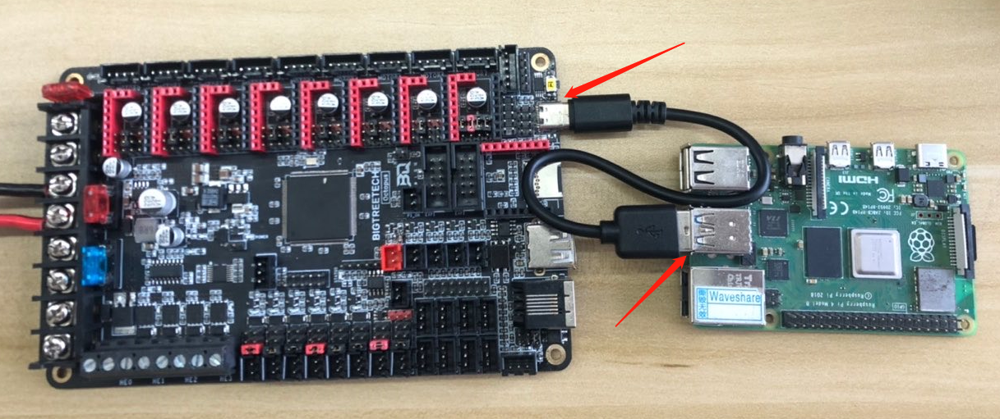

# How to use Klipper on Octopus

## NOTE: 

* This motherboard comes with bootloader which allows firmware update through SD card. We recommend using SD card to update firmware instead of DFU. If you have ever used DFU to upload firmware, you can use the instructions [here](https://github.com/bigtreetech/BIGTREETECH-OCTOPUS-V1.0/tree/master/Firmware/DFU%20Update%20bootloader) to restore the bootloader of this motherboard.

## Wiring diagram

### Power raspberry pi with Octopus +5V

## Generate the firmware.bin

1. Precompiled firmware(The source code version used is [Commits on Jun 28, 2021](https://github.com/KevinOConnor/klipper/commit/430578957f37f42815ffea900cbc3459d6fd0888))
   * [firmware-USB.bin](https://github.com/bigtreetech/BIGTREETECH-OCTOPUS-V1.0/blob/master/Firmware/Klipper/firmware-USB.bin) Use USB to communicate with raspberry pi. Connect the type-A USB of raspberry pi with the type-C of motherboard directly to communicate normally.
   * [firmware-USART2.bin](https://github.com/bigtreetech/BIGTREETECH-OCTOPUS-V1.0/blob/master/Firmware/Klipper/firmware-USART2.bin) Use USART2 to communicate with raspberry pi. Connect the UART-TX of raspberry pi with the USART-RX2 of motherboard and connect the UART-RX of raspberry pi with the USART-TX2 of motherboard directly to communicate normally.

2. Build your own firmware
   1. Refer to [klipper's official installation](https://www.klipper3d.org/Installation.html) to download klipper source code to raspberry pi
   2. `Building the micro-controller` with the configuration shown below.
      * [*] Enable extra low-level configuration options
      * Micro-controller Architecture = `STMicroelectronics STM32`
      * Processor model = `STM32F446`
      * Bootloader offset = `32KiB bootloader`
      * Clock Reference = `12 MHz crystal`
      * IF USE USB
         * Communication interface = `USB (on PA11/PA12)`
      * ElSE IF USE USART2
         * Communication interface = `Serial (on USART2 PD6/PD5)`
      * ELSE              
         * Communication interface = `The port you want`

      
    3. The `klipper.bin` file will be generated in the folder `home/pi/kliiper/out` after `make`. And you can use the windows computer under the same LAN as raspberry pi to copy `klipper.bin` from raspberry pi to the computer with `pscp` command in the CMD terminal. such as `pscp -C pi@192.168.0.101:/home/pi/klipper/out/klipper.bin c:\klipper.bin`(The terminal may prompt that `The server's host key is not cached` and ask `Store key in cache?((y/n)`, Please type `y` to store. And then it will ask for a password, please type the default password `raspberry` for raspberry pi)

## Update the firmware.bin

1. Renamed the `firmware-USB.bin`, `firmware-USB.bin` or the `klipper.bin`(in folder `home/pi/kliiper/out` build by yourself) to `firmware.bin`
2. Copy the `firmware.bin` to the root directory of SD card (make sure SD card is in FAT32 format)
3. Insert the SD card into the card slot of the motherboard
4. Press the reset button or restart the power supply, the motherboard will automatically update the `firmware.bin`

## Configure the printer parameters
### Basic configuration
1. Refer to [klipper's official installation](https://www.klipper3d.org/Installation.html) to `Configuring OctoPrint to use Klipper`
2. Refer to [klipper's official installation](https://www.klipper3d.org/Installation.html) to `Configuring Klipper`. And use the configuration file [Octopus klipper.cfg](https://github.com/bigtreetech/BIGTREETECH-OCTOPUS-V1.0/blob/master/Firmware/Klipper/Octopus%20klipper.cfg) as the underlying `printer.cfg`, which includes all the correct pinout for Octopus
3. Refer to [klipper's official Config_Reference](https://www.klipper3d.org/Config_Reference.html) to configure the features you want.
4. run the `ls /dev/serial/by-id/*` command in raspberry pi to get the correct ID number of the motherboard, and set the correct ID number in `printer.cfg`
    ``` 
    [mcu]
    serial: /dev/serial/by-id/usb-Klipper_stm32f446xx_0E002B00135053424E363620-if00
    ```
<!-- 
### LCD2004
[LCD2004](https://github.com/bigtreetech/BIGTREETECH-OCTOPUS-V1.0/blob/559c8421dbc26bd940891e754a430d31d860170a/Firmware/Klipper/Octopus%20klipper.cfg#L307)

    ```
    [display]
    lcd_type: hd44780
    rs_pin: EXP1_4
    e_pin: EXP1_3
    d4_pin: EXP1_5
    d5_pin: EXP1_6
    d6_pin: EXP1_7
    d7_pin: EXP1_8
    encoder_pins: ^EXP2_3, ^EXP2_5
    click_pin: ^!EXP1_2
    kill_pin: ^!EXP2_8

    [output_pin beeper]
    pin: EXP1_1
    ```

### LCD12864
[LCD12864](https://github.com/bigtreetech/BIGTREETECH-OCTOPUS-V1.0/blob/559c8421dbc26bd940891e754a430d31d860170a/Firmware/Klipper/Octopus%20klipper.cfg#L290)

    ``` 
    [display]
    lcd_type: st7920
    cs_pin: EXP1_4
    sclk_pin: EXP1_5
    sid_pin: EXP1_3
    encoder_pins: ^EXP2_5, ^EXP2_3
    click_pin: ^!EXP1_2
    kill_pin: ^!EXP2_8

    [output_pin beeper]
    pin: EXP1_1
    ``` 

### Mini12864 with neopixel backlight leds
[Mini12864](https://github.com/bigtreetech/BIGTREETECH-OCTOPUS-V1.0/blob/559c8421dbc26bd940891e754a430d31d860170a/Firmware/Klipper/Octopus%20klipper.cfg#L326)

    ``` 
    [display]
    lcd_type: uc1701
    cs_pin: EXP1_3
    a0_pin: EXP1_4
    rst_pin: EXP1_5
    encoder_pins: ^EXP2_5, ^EXP2_3
    click_pin: ^!EXP1_2
    ## Some micro-controller boards may require an spi bus to be specified:
    #spi_bus: spi
    ## Alternatively, some micro-controller boards may work with software spi:
    spi_software_mosi_pin: PA7
    spi_software_miso_pin: PA6
    spi_software_sclk_pin: PA5

    [output_pin beeper]
    pin: EXP1_1

    [neopixel btt_mini12864]
    pin: EXP1_6
    chain_count: 3
    color_order: RGB
    initial_RED: 0.4
    initial_GREEN: 0.4
    initial_BLUE: 0.4
    ``` 
         -->