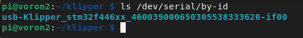

# [View English version](./README.md)

# 在Octopus (Pro)主板上使用 Klipper

## 注意: 

* 此主板出厂时自带了引导程序，允许通过microSD卡更新固件(firmware.bin)，因为DFU的方式可能会误将主板的引导程序擦除，所以我们推荐使用SD卡更新固件。如果你通过DFU或者其他任何方式将主板的引导程序损坏了，可以参考[这里](/Firmware/DFU%20Update%20bootloader) 自行烧录恢复主板的引导程序。请注意区分你主板上MCU的类型是 `STM32F446` 还是 `STM32F429` ，不同的MCU对应了不同的引导程序。
* [BTT_OctoPus_Voron2_Config.cfg](./BTT_OctoPus_Voron2_Config.cfg) 是 Voron2.4 的配置文件，你可以基于此文件修改配置成你自己的配置文件(注意: 此配置文件中 XYZ 轴没有使能 `position_max` 参数，我们提供了三个尺寸：250/300/350，必须选择一个使能，或者设置你自定义的尺寸)

## Pinout
### 树莓派 pinout
<br/>

### Ocotpus V1.0/V1.1 pinout(Thanks [Thomas White](https://www.facebook.com/groups/505736576548648/user/100000740067128/) for the pinout of Octopus)
<br/>

### Ocotpus Pro pinout
<br/>

## 接线图
### 使用额外的5V电源适配器给树莓派供电，并且通过 USB 与 Octopus (Pro) 通信
<br/>

### 使用主板的+5V给树莓派供电，并且通过 UART 与 Octopus V1.0/V1.1 通信
<br/>

### 使用主板的+5V给树莓派供电，并且通过 UART 与 Octopus Pro 通信
<br/>

## 编译固件
1. `STM32F446` 已编译好直接使用的文件(此二进制文件所使用的源码是 [Commits on Jun 28, 2021](https://github.com/Klipper3d/klipper/commit/430578957f37f42815ffea900cbc3459d6fd0888))
   * [firmware-F446-USB.bin](./firmware-F446-USB.bin) 使用 USB 与树莓派通信。直接通过数据线将树莓派的USB-A连接到主板的USB-C接口即可正常通信。
   * [firmware-F446-USART2.bin](./firmware-F446-USART2.bin) 使用 USART2 与树莓派通信. 通过杜邦线将树莓派的 UART-TX 接到主板的 USART-RX2 ，将树莓派的 UART-RX 接到主板的 USART-TX2 ，并且将地线连接在一起即可正常通信。

2. `STM32F429` 已编译好直接使用的文件(此二进制文件所使用的源码是 [Commits on Oct 17, 2021](https://github.com/Klipper3d/klipper/commit/5c10001bc525701f0ef004041cbbf093522f6de6))
   * [firmware-F429-USB.bin](./firmware-F429-USB.bin) 使用 USB 与树莓派通信。直接通过数据线将树莓派的USB-A连接到主板的USB-C接口即可正常通信。
   * [firmware-F429-USART2.bin](./firmware-F429-USART2.bin) 使用 USART2 与树莓派通信. 通过杜邦线将树莓派的 UART-TX 接到主板的 USART-RX2 ，将树莓派的 UART-RX 接到主板的 USART-TX2 ，并且将地线连接在一起即可正常通信。

3. 自行编译最新版本的固件<br/>
   ***注意: 请注意区分主板上MCU的类型是 `STM32F446 + 12 MHz crystal` 还是 `STM32F429 + 8 MHz crystal`***
   1. 参考 [klipper官方的安装说明](https://www.klipper3d.org/Installation.html) 下载klipper源码到树莓派
   2. 使用下面的配置去编译固件
      * [*] Enable extra low-level configuration options
      * Micro-controller Architecture = `STMicroelectronics STM32`
      * Processor model = `STM32F446` 或者 `STM32F429` (取决于主板实际的 MCU 类型)
      * Bootloader offset = `32KiB bootloader`
      * Clock Reference = `12 MHz crystal`(`STM32F446`使用 12MHz) or `8 MHz crystal`(`STM32F429`使用 8MHz)
      * 如果使用 USB 与树莓派通信
         * Communication interface = `USB (on PA11/PA12)`
      * 如果使用 USART2 与树莓派通信
         * Communication interface = `Serial (on USART2 PD6/PD5)`
      * 或者
         * Communication interface = `你自己想使用的端口`

      <br/>
      <br/>
   3. 配置选择完成后, 输入 `q` 退出配置界面，当询问是否保存配置是选择 "Yes" .
   4. 输入 `make` 命令开始编译固件
   5. 当 `make` 命令执行完成后，会在树莓派的`home/pi/kliiper/out`的文件夹中生成我们所需要的`klipper.bin`固件。你可以在CMD命令行终端中通过`pscp`命令把`klipper.bin`固件复制到与树莓派在同一个局域网下的电脑上。例如 `pscp -C pi@192.168.0.101:/home/pi/klipper/out/klipper.bin c:\klipper.bin`(命令行会提示 `The server's host key is not cached` 并且询问 `Store key in cache?((y/n)`, 输入 `y` 保存 host key，然后输入树莓派默认的密码：`raspberry`)

## 更新固件
### 方法1: 通过DFU更新
   * 需要USB连接树莓派和主板
   * 需要在主板上插上额外的跳帽

   1. 将主板完全断电
   2. 在BOOT0和3.3V上插上跳帽短接
   3. 将树莓派和主板通过USB-C连接在一起
   4. 给主板通电
   5. 通过 ssh 命令终端输入 `lsusb` 命令查询DFU设备的ID.
   6. 运行 `make flash FLASH_DEVICE=1234:5678` 命令，将1234:5678替换为上一步中查询到的实际的DFU设备ID
   7. 将主板完全断电
   8. 移除BOOT0和3.3V上的跳帽
   9. 给主板通电
   10. 你可以输入 `ls /dev/serial/by-id` 查询主板的串口ID来确认固件是否烧录成功，如果烧录成功了会返回一个klipper的设备ID，如下图所示:

   

   (注意: 此步骤仅适用于USB通信的工作方式，如果使用USART通信则没有这种ID)

### 方法 2: 通过microSD卡更新
1. 你可以使用 [编译固件 3.5](#编译固件) 中的方法或者使用 `cyberduck`、 `winscp` 工具软件从树莓派中将 `klipper.bin` 文件复制到电脑上
2. 将我们提供的`firmware-F4xx-USB.bin`, `firmware-F4xx-USART2.bin` 或者你自行编译的 `klipper.bin` 文件重命名为 `firmware.bin`<br/>
**提示:** 如果没有重命名为 `firmware.bin`，引导程序将不会识别并更新此文件
3. 复制 `firmware.bin` 到microSD卡的根目录中(确保SD卡的文件系统是FAT32格式)
4. 将主板断电
5. 插入microSD卡
6. 给主板通电
7. 仅需几秒钟，主板就会自动完成更新固件的步骤
8. 你可以输入 `ls /dev/serial/by-id` 查询主板的串口ID来确认固件是否烧录成功，如果烧录成功了会返回一个klipper的设备ID，如下图所示:


(注意: 此步骤仅适用于USB通信的工作方式，如果使用USART通信则没有这种ID)

## 配置打印机的参数
### 基础配置
1. 参考 [klipper官方的安装说明](https://www.klipper3d.org/Installation.html) to `Configuring OctoPrint to use Klipper`
2. 参考 [klipper官方的安装说明](https://www.klipper3d.org/Installation.html) to `Configuring Klipper`. 并且使用我们提供的配置文件 [BTT_OctoPus_Voron2_Config.cfg](./BTT_OctoPus_Voron2_Config.cfg)为基础去修改 `printer.cfg`, 此文件中包含了主板几乎所有的pinout
3. 参考 [klipper官方的配置说明Config_Reference](https://www.klipper3d.org/Config_Reference.html) 去配置你想要的特性和功能
4. 如果你想通过USB与树莓派通信，运行 `ls /dev/serial/by-id/*` 命令去查询主板的设备ID号，在 `printer.cfg` 设置查询到的实际设备ID号，并且接线图请参考[这里](#使用额外的5v电源适配器给树莓派供电并且通过-usb-与-octopus-pro-通信)
    ```
    [mcu]
    serial: /dev/serial/by-id/usb-Klipper_stm32f446xx_0E002B00135053424E363620-if00
    ```
    <br/>
5. 如果你想通过USART2与树莓派通信, 你需要修改一下的文件(你可以通过SSH终端输入命令修改，可以直接修改树莓派系统SD卡中的文件)，并且接线图请参考 [Octopus V1.0/V1.1 这里](#使用主板的5v给树莓派供电并且通过-uart-与-octopus-v10v11-通信) or [Octopus Pro 这里](#使用主板的5v给树莓派供电并且通过-uart-与-octopus-pro-通信)
   * 在 `/boot/cmdline.txt` 文件中删除 `console=serial0,115200` 
   * 在 `/boot/config.txt` 文件的末尾添加 `dtoverlay=pi3-miniuart-bt`
   * 修改配置文件 `printer.cfg` 的 `[mcu]` 部分为 `serial: /dev/ttyAMA0` 并且添加 `restart_method: command`
     ```
     [mcu]
     serial: /dev/ttyAMA0
     restart_method: command
     ```
     <br/>

### LCD12864 (RepRapDiscount 128x64 Full Graphic Smart Controller): 将 `printer.cfg` 的 `display` 部分设置为如下所示，开启LCD12864屏幕
   ```
   [display]
   lcd_type: st7920
   cs_pin: EXP1_4
   sclk_pin: EXP1_5
   sid_pin: EXP1_3
   encoder_pins: ^EXP2_5, ^EXP2_3
   click_pin: ^!EXP1_2
   kill_pin: ^!EXP2_8

   [output_pin beeper]
   pin: EXP1_1
   ```
   <br/>

### LCD2004 (RepRapDiscount 2004 Smart Controller): 将 `printer.cfg` 的 `display` 部分设置为如下所示，开启LCD2004屏幕
   ```
   [display]
   lcd_type: hd44780
   rs_pin: EXP1_4
   e_pin: EXP1_3
   d4_pin: EXP1_5
   d5_pin: EXP1_6
   d6_pin: EXP1_7
   d7_pin: EXP1_8
   encoder_pins: ^EXP2_3, ^EXP2_5
   click_pin: ^!EXP1_2
   kill_pin: ^!EXP2_8

   [output_pin beeper]
   pin: EXP1_1
   ```
   <br/>

### Mini12864 (带有neopixel RGB背光灯的 Mini 12864 显示屏):  将 `printer.cfg` 的 `display` 部分设置为如下所示
   ```
   [display]
   lcd_type: uc1701
   cs_pin: EXP1_3
   a0_pin: EXP1_4
   rst_pin: EXP1_5
   encoder_pins: ^EXP2_5, ^EXP2_3
   click_pin: ^!EXP1_2
   ## Some micro-controller boards may require an spi bus to be specified:
   #spi_bus: spi
   ## Alternatively, some micro-controller boards may work with software spi:
   contrast: 63
   spi_software_mosi_pin: PA7
   spi_software_miso_pin: PA6
   spi_software_sclk_pin: PA5

   [output_pin beeper]
   pin: EXP1_1

   [neopixel btt_mini12864]
   pin: EXP1_6
   chain_count: 3
   color_order: RGB
   initial_RED: 0.4
   initial_GREEN: 0.4
   initial_BLUE: 0.4
   ```
   <br/>

### BigTreeTech TFT 触摸屏模拟12864模式(Marlin 模式):  将 `printer.cfg` 的 `display` 部分设置为如下所示
   ```
   [display]
   lcd_type: emulated_st7920
   spi_software_miso_pin: PA6
   spi_software_mosi_pin: EXP1_3
   spi_software_sclk_pin: EXP1_5
   en_pin: EXP1_4
   encoder_pins: ^EXP2_5, ^EXP2_3
   click_pin: ^!EXP1_2

   [output_pin beeper]
   pin: EXP1_1
   ```
   <br/>
